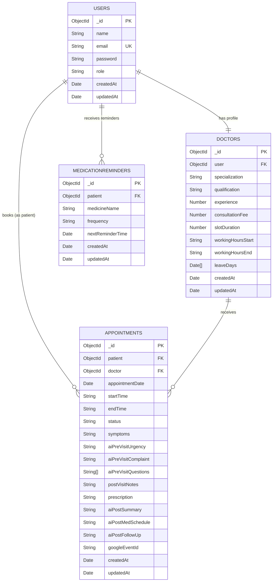

# DATABASE_SCHEMA.md — MediFlow Healthcare Appointment Manager

---

## Overview

MediFlow uses **MongoDB** (via **Mongoose ODM**) as its database. There are **4 collections**:

| Collection | Model File | Purpose |
|---|---|---|
| `users` | `User.js` | Authentication & role management |
| `doctors` | `Doctor.js` | Doctor professional profiles |
| `appointments` | `Appointment.js` | Appointment records with AI data |
| `medicationreminders` | `MedicationReminder.js` | Medication schedule tracking |

---

## Collection: `users`

Stores authentication credentials and role information for all system users (patients, doctors, admins).

### Fields

| Field | Type | Required | Unique | Default | Validation |
|---|---|---|---|---|---|
| `_id` | ObjectId | Auto | Yes | Auto | — |
| `name` | String | Yes | No | — | trim |
| `email` | String | Yes | Yes | — | lowercase, trim |
| `password` | String | Yes | No | — | minlength: 6, select: false |
| `role` | String | No | No | `"patient"` | enum: `["patient","doctor","admin"]` |
| `createdAt` | Date | Auto | No | Auto | timestamps |
| `updatedAt` | Date | Auto | No | Auto | timestamps |

### Indexes
- **Unique** on `email` (default MongoDB unique index)

### Methods
| Method | Description |
|---|---|
| `comparePassword(enteredPassword)` | bcrypt comparison of plain-text vs. stored hash |
| `generateToken()` | Signs a JWT with `{_id, role}` payload, 7-day expiry |

### Pre-save Hook
Password is hashed with **bcryptjs (salt rounds: 10)** before save if modified.

### Schema Definition (Mongoose)
```javascript
{
  name:     { type: String, required: true, trim: true },
  email:    { type: String, required: true, unique: true, lowercase: true, trim: true },
  password: { type: String, required: true, minlength: 6, select: false },
  role:     { type: String, enum: ["patient","doctor","admin"], default: "patient" }
}
```

---

## Collection: `doctors`

Stores professional profile information for doctors. Linked 1:1 to a `users` document.

### Fields

| Field | Type | Required | Unique | Default | Validation |
|---|---|---|---|---|---|
| `_id` | ObjectId | Auto | Yes | Auto | — |
| `user` | ObjectId (ref: User) | Yes | Yes | — | Foreign key to `users._id` |
| `specialization` | String | Yes | No | — | trim |
| `qualification` | String | No | No | `""` | — |
| `experience` | Number | No | No | `0` | — |
| `consultationFee` | Number | No | No | `500` | — |
| `slotDuration` | Number | No | No | `30` | Minutes per slot |
| `workingHours.start` | String | No | No | `"09:00"` | HH:MM format |
| `workingHours.end` | String | No | No | `"18:00"` | HH:MM format |
| `leaveDays` | [Date] | No | No | `[]` | Array of leave dates |
| `createdAt` | Date | Auto | No | Auto | timestamps |
| `updatedAt` | Date | Auto | No | Auto | timestamps |

### Indexes
- **Unique** on `user` — enforces 1:1 User-Doctor relationship

### Relationships
- `user` → `users._id` (one-to-one, required)

### Schema Definition (Mongoose)
```javascript
{
  user: { type: mongoose.Schema.Types.ObjectId, ref: "User", required: true, unique: true },
  specialization: { type: String, required: true, trim: true },
  qualification:  { type: String, default: "" },
  experience:     { type: Number, default: 0 },
  consultationFee:{ type: Number, default: 500 },
  slotDuration:   { type: Number, default: 30 },
  workingHours: {
    start: { type: String, default: "09:00" },
    end:   { type: String, default: "18:00" }
  },
  leaveDays: [{ type: Date }]
}
```

---

## Collection: `appointments`

The central collection of the system. Stores booking details, AI-generated summaries, clinical notes, and Google Calendar event IDs.

### Fields

| Field | Type | Required | Default | Validation |
|---|---|---|---|---|
| `_id` | ObjectId | Auto | Auto | — |
| `patient` | ObjectId (ref: User) | No | — | Patient's `users._id` |
| `doctor` | ObjectId (ref: Doctor) | No | — | Doctor's `doctors._id` |
| `appointmentDate` | Date | No | — | UTC midnight normalized |
| `startTime` | String | No | — | HH:MM format |
| `endTime` | String | No | — | HH:MM format |
| `status` | String | No | `"BOOKED"` | enum: `["BOOKED","COMPLETED","CANCELLED"]` |
| `symptoms` | String | No | — | Patient-reported symptoms |
| `aiPreVisitSummary.urgencyLevel` | String | No | — | e.g. "High", "Low" |
| `aiPreVisitSummary.chiefComplaint` | String | No | — | AI-generated complaint |
| `aiPreVisitSummary.suggestedQuestions` | [String] | No | `[]` | Questions for doctor |
| `postVisitNotes` | String | No | — | Doctor's clinical notes |
| `prescription` | String | No | — | Doctor's prescription text |
| `aiPostVisitSummary.summary` | String | No | — | Patient-friendly summary |
| `aiPostVisitSummary.medicationSchedule` | String | No | — | Medication instructions |
| `aiPostVisitSummary.followUpSteps` | String | No | — | Follow-up instructions |
| `googleEventId` | String | No | — | Google Calendar event ID |
| `createdAt` | Date | Auto | Auto | timestamps |
| `updatedAt` | Date | Auto | Auto | timestamps |

### Indexes
```javascript
// Compound unique index — prevents double booking
appointmentSchema.index(
  { doctor: 1, appointmentDate: 1, startTime: 1 },
  { unique: true }
)
```

### Relationships
- `patient` → `users._id` (many-to-one)
- `doctor` → `doctors._id` (many-to-one)

### Schema Definition (Mongoose)
```javascript
{
  patient:         { type: mongoose.Schema.Types.ObjectId, ref: "User" },
  doctor:          { type: mongoose.Schema.Types.ObjectId, ref: "Doctor" },
  appointmentDate: Date,
  startTime:       String,
  endTime:         String,
  status:          { type: String, enum: ["BOOKED","COMPLETED","CANCELLED"], default: "BOOKED" },
  symptoms:        String,
  aiPreVisitSummary: {
    urgencyLevel:       String,
    chiefComplaint:     String,
    suggestedQuestions: [String]
  },
  postVisitNotes:  { type: String },
  prescription:    { type: String },
  aiPostVisitSummary: {
    summary:             String,
    medicationSchedule:  String,
    followUpSteps:       String
  },
  googleEventId: String
}
```

---

## Collection: `medicationreminders`

Tracks medication reminders created when a doctor prescribes medications. Queried by the cron job every 2 hours.

### Fields

| Field | Type | Required | Default | Validation |
|---|---|---|---|---|
| `_id` | ObjectId | Auto | Auto | — |
| `patient` | ObjectId (ref: User) | No | — | Patient's `users._id` |
| `medicineName` | String | No | — | Name of the medication |
| `frequency` | String | No | — | enum: `["once","twice","thrice"]` |
| `nextReminderTime` | Date | No | — | Next scheduled reminder UTC |
| `createdAt` | Date | Auto | Auto | timestamps |
| `updatedAt` | Date | Auto | Auto | timestamps |

### Relationships
- `patient` → `users._id` (many-to-one)

### Schema Definition (Mongoose)
```javascript
{
  patient:          { type: mongoose.Schema.Types.ObjectId, ref: "User" },
  medicineName:     String,
  frequency:        { type: String, enum: ["once","twice","thrice"] },
  nextReminderTime: Date
}
```

### Reminder Schedule Logic
| Frequency | Schedule |
|---|---|
| `once` | Daily at 8:00 AM IST (02:30 UTC) |
| `twice` | 8:00 AM IST (02:30 UTC) and 8:00 PM IST (14:30 UTC) |
| `thrice` | 8:00 AM (02:30), 2:00 PM (08:30), 8:00 PM (14:30) IST |

---

## Entity-Relationship Diagram



---

## Database Design Notes

### Normalization vs. Embedding
- **Embedded**: `aiPreVisitSummary` and `aiPostVisitSummary` are embedded in `Appointment` (avoids extra collection lookups for co-located read operations).
- **Referenced**: `patient` and `doctor` are stored as ObjectId references (normalized) to avoid data duplication and allow independent updates.

### Double-Booking Prevention
The compound unique index on `{doctor, appointmentDate, startTime}` prevents race conditions at the database level, even when two requests arrive simultaneously.

### Password Security
The `password` field uses `select: false` — it is never returned in queries unless explicitly `.select("+password")`. Hashed at rest using bcryptjs with 10 salt rounds.

### IST Timezone Handling
All date operations normalize to UTC midnight (`setUTCHours(0,0,0,0)`) for consistent date comparison across time zones, while display logic converts back to IST (Asia/Kolkata) using `toLocaleString`.
