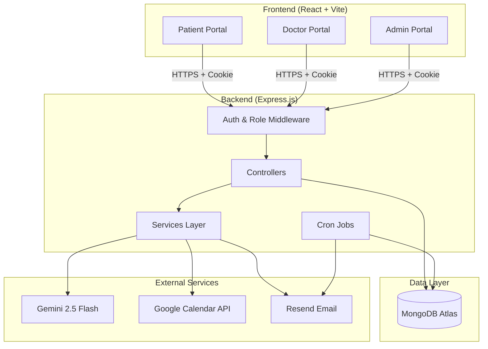
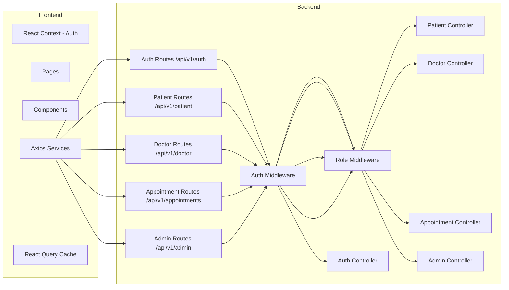
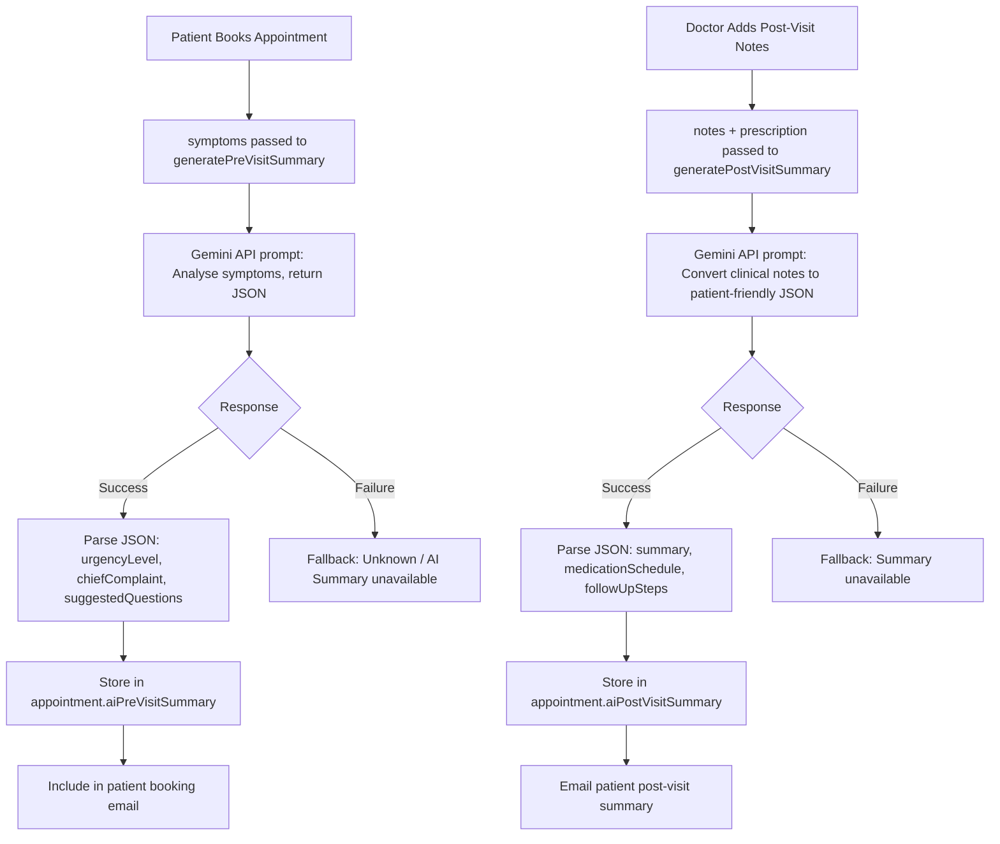
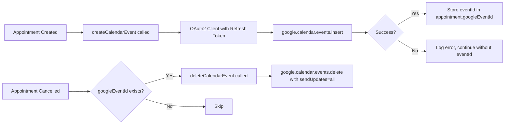

# SYSTEM_DESIGN.md — MediFlow Healthcare Appointment Manager

---

## Problem Statement

Healthcare appointment management in clinics and hospitals is plagued by inefficiencies: manual scheduling causes double bookings, patients forget visits, doctors lack organized clinical notes, and admins have no centralized view of operations. **MediFlow** solves these problems with a unified digital platform providing role-based access for patients, doctors, and admins — augmented with AI-generated summaries, automated email notifications, and Google Calendar integration.

---

## High-Level Architecture

MediFlow follows a **3-tier client-server architecture**:

- **Presentation Layer**: React SPA (Vite) — patient, doctor, admin portals
- **Application Layer**: Node.js + Express REST API
- **Data Layer**: MongoDB Atlas with Mongoose ODM

External services are integrated as sidecar services:
- **Gemini AI** (Google Generative AI SDK)
- **Google Calendar API** (googleapis SDK)
- **Resend** (email delivery)
- **node-cron** (background jobs)



---

## Component Diagram



---

## Authentication Flow

Cookie-based JWT authentication. Token is stored in an `httpOnly` cookie, preventing XSS attacks.

```mermaid
sequenceDiagram
    participant C as Client (Browser)
    participant API as Express API
    participant DB as MongoDB
    participant MW as Auth Middleware

    C->>API: POST /api/v1/auth/login {email, password}
    API->>DB: User.findOne({email}).select("+password")
    DB-->>API: User document
    API->>API: bcrypt.compare(password, hash)
    API->>API: jwt.sign({_id, role}, JWT_SECRET, {expiresIn: "7d"})
    API-->>C: Set-Cookie: accessToken=({JWT}); httpOnly

    Note over C,MW: Subsequent protected requests
    C->>API: GET /api/v1/auth/me [Cookie: accessToken]
    API->>MW: protect middleware
    MW->>MW: jwt.verify(token, JWT_SECRET)
    MW->>DB: User.findById(decoded._id)
    DB-->>MW: User (without password)
    MW->>API: req.user = user
    API-->>C: 200 OK {user}
```

---

## Database Design Decisions

### 1. User + Doctor Split Pattern
`User` holds authentication credentials (email, password, role). `Doctor` holds professional profile data with a 1:1 reference to `User`. This separation allows:
- Clean role-based queries
- Independent updates to auth vs. profile data
- No redundant data for patients who don't need a profile document

### 2. Unique Index on Appointments
A compound unique index on `{doctor, appointmentDate, startTime}` enforces double-booking prevention at the database level — complementing application-level checks for defense-in-depth.

### 3. Embedded AI Summaries
`aiPreVisitSummary` and `aiPostVisitSummary` are embedded as sub-documents directly in `Appointment`. This avoids a separate collection join and keeps all appointment data co-located for fast retrieval.

### 4. MedicationReminder as a Separate Collection
Medication reminders have an independent lifecycle from appointments (they need to fire repeatedly over days). Keeping them separate allows the cron job to query them efficiently without touching the appointments collection.

---

## AI Integration Design

The system uses **Gemini 2.5 Flash** via the Google Generative AI SDK.



**Failure Handling**: Both AI functions are wrapped in try/catch. On failure, a graceful fallback object is returned so appointment booking is never blocked by an AI failure.

---

## Email System Design

Emails are sent via **Resend** using HTML templates defined in `emailTemplates.js`.

**Events that trigger emails:**
| Event | Recipients |
|---|---|
| Appointment Booked | Patient, Doctor, All Admins |
| Appointment Cancelled | Patient, Doctor |
| Doctor Created | Doctor (welcome), All Admins |
| Doctor Deleted | Doctor, All Admins |
| Leave Added | Doctor, All Admins, Affected Patients |
| Post-Visit Notes Added | Patient, Doctor |
| Medication Reminder | Patient (via cron job every 2 hours) |

**Design**: Email sending is wrapped in try/catch inside the booking flow. Email failures do NOT block the primary operation — the appointment is still created successfully.

---

## Google Calendar Integration



OAuth2 is configured with a persistent `GOOGLE_REFRESH_TOKEN`, allowing server-to-server calendar access without user interaction. Attendees (patient + doctor) are added so they receive Google Calendar invitations.

---

## Assumptions

1. All users share a single authentication table; roles differentiate behavior.
2. Time zones are standardized to **IST (Asia/Kolkata)** for all scheduling logic.
3. Admin users must be manually seeded; there is no admin self-registration.
4. Google Calendar events are created on the admin/system calendar (primary), not individual user calendars.
5. Medication reminders run indefinitely until manually removed from the database.
6. The `slotDuration` is uniform per doctor (no per-day variation).

---

## Trade-offs

| Decision | Trade-off |
|---|---|
| Cookie-based auth (httpOnly) | Secure against XSS but requires `sameSite`/CORS setup for cross-domain deployment |
| AI summary inline with booking | Adds ~1-2s latency to booking API but provides immediate value |
| Email in booking flow (not queued) | Simpler code but potential timeout if Resend is slow; a job queue would be more resilient |
| No refresh token rotation | Simpler implementation but 7-day token expiry is a longer window |
| Unique index for double-booking | Database-level guarantee but requires application-level pre-check for user-friendly error messages |

---

## Scalability Considerations

- **Horizontal Scaling**: The stateless JWT + cookie approach means multiple backend instances can run without shared session state.
- **Database**: MongoDB Atlas supports auto-scaling. Compound indexes on `Appointment` ensure O(log n) booking conflict checks.
- **Email Queue**: For high traffic, replace inline `sendEmail()` calls with a job queue (Bull/BullMQ + Redis) to avoid blocking the booking API.
- **Cron Jobs**: For multi-instance deployments, use a distributed lock (Redis SETNX) to prevent duplicate reminder emails from multiple instances.
- **AI Rate Limiting**: Gemini API has rate limits. Under load, implement a queue or circuit breaker for AI summary generation.

---

## Future Improvements

- WebSocket (Socket.IO) for real-time appointment status updates
- Job queue (BullMQ) for resilient email/AI processing
- Refresh token rotation with Redis-backed token store
- Rate limiting middleware (`express-rate-limit`)
- Input sanitization (`express-validator` or Zod on backend)
- Distributed cron locking for multi-instance deployments
