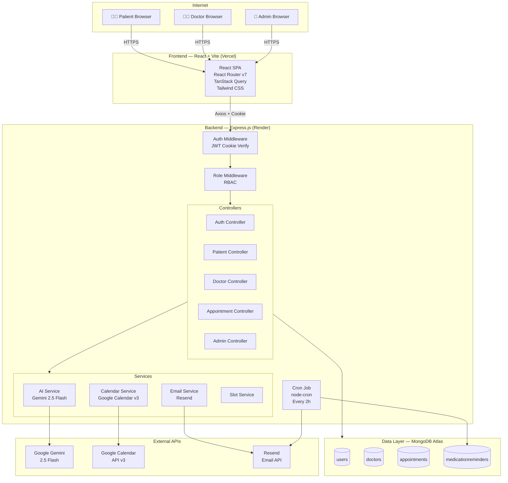
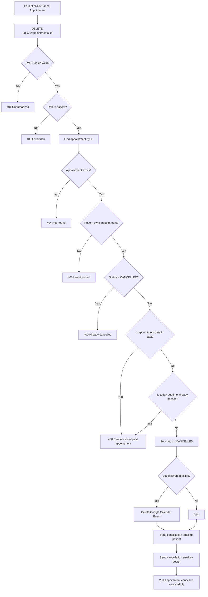
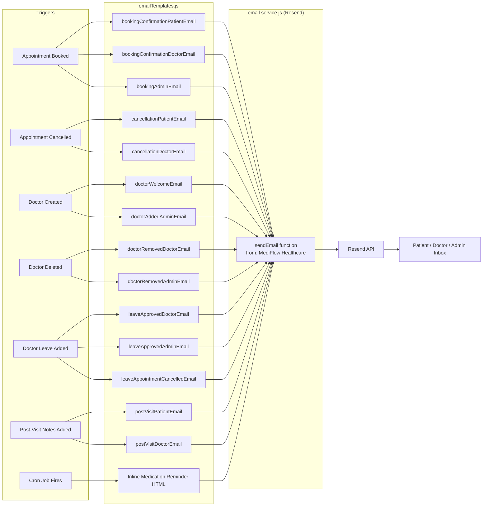
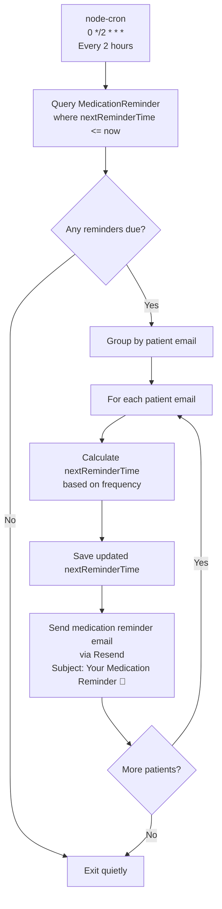

# architecture-diagram.md — MediFlow System Architecture Diagrams

> All diagrams use **Mermaid** syntax.

---

## 1. System Architecture Diagram



---

## 2. Sequence Diagram — Appointment Booking Flow

```mermaid
sequenceDiagram
    actor P as Patient
    participant FE as React Frontend
    participant API as Express Backend
    participant DB as MongoDB
    participant AI as Gemini AI
    participant CAL as Google Calendar
    participant EMAIL as Resend

    P->>FE: Select doctor, date, slot, enter symptoms
    FE->>API: POST /api/v1/appointments {doctorId, date, startTime, endTime, symptoms}
    API->>API: Auth Middleware (verify JWT cookie)
    API->>API: Role Middleware (patient only)

    API->>DB: Check doctor exists (Doctor.findById)
    DB-->>API: Doctor document

    API->>DB: Check slot not already booked
    DB-->>API: null (slot free)

    API->>DB: Check patient has no conflict at same time
    DB-->>API: null (no conflict)

    API->>AI: generatePreVisitSummary(symptoms)
    AI-->>API: {urgencyLevel, chiefComplaint, suggestedQuestions}

    API->>DB: Appointment.create({patient, doctor, date, time, aiSummary})
    DB-->>API: Appointment document

    par Email Notifications
        API->>EMAIL: Booking confirmation to patient
        API->>EMAIL: Booking notification to doctor
        API->>EMAIL: Booking notification to admins
    end

    API->>CAL: createCalendarEvent(appointment, names, emails)
    CAL-->>API: googleEventId

    API->>DB: appointment.googleEventId = eventId; save()

    API-->>FE: 201 Created {appointment}
    FE-->>P: Success toast + appointment details with AI summary
```

---

## 3. Authentication Flow Diagram

```mermaid
sequenceDiagram
    actor U as User (Patient/Doctor/Admin)
    participant FE as React Frontend
    participant API as Express Backend
    participant DB as MongoDB
    participant MW as Auth Middleware

    Note over U,DB: Registration Flow
    U->>FE: Fill registration form (name, email, password)
    FE->>API: POST /api/v1/auth/register
    API->>API: Validate email format
    API->>DB: User.findOne({email}) — check existing
    DB-->>API: null (user free)
    API->>DB: User.create({name, email, password, role: "patient"})
    Note over DB: Pre-save hook: bcrypt.hash(password, 10)
    DB-->>API: User document (no password)
    API->>API: jwt.sign({_id, role}, JWT_SECRET, {expiresIn: "7d"})
    API-->>FE: 201 + Set-Cookie: accessToken=<JWT>; HttpOnly; SameSite=Lax
    FE-->>U: Redirect to /dashboard

    Note over U,DB: Login Flow
    U->>FE: Enter email + password
    FE->>API: POST /api/v1/auth/login
    API->>DB: User.findOne({email}).select("+password")
    DB-->>API: User with hashed password
    API->>API: bcrypt.compare(enteredPassword, hash)
    API->>API: jwt.sign({_id, role}, JWT_SECRET, "7d")
    API-->>FE: 200 + Set-Cookie: accessToken=<JWT>; HttpOnly
    FE-->>U: Redirect to role-based dashboard

    Note over U,MW: Protected Request Flow
    U->>FE: Navigate to protected page
    FE->>API: GET /api/v1/auth/me [Cookie: accessToken]
    API->>MW: protect middleware
    MW->>MW: jwt.verify(token, JWT_SECRET)
    MW->>DB: User.findById(decoded._id).select("-password")
    DB-->>MW: User document
    MW-->>API: req.user = user
    API-->>FE: 200 {user}
    FE-->>U: Render dashboard

    Note over U,FE: Logout Flow
    U->>FE: Click logout
    FE->>API: POST /api/v1/auth/logout
    API-->>FE: 200 + clearCookie(accessToken)
    FE-->>U: Redirect to /login
```

---

## 4. Appointment Cancellation Flow



---

## 5. Email Notification Flow



---

## 6. Google Calendar Integration Flow

```mermaid
sequenceDiagram
    participant API as Express Backend
    participant OA2 as OAuth2 Client
    participant GCAL as Google Calendar API

    Note over API,GCAL: Appointment Created
    API->>OA2: Initialize with GOOGLE_REFRESH_TOKEN
    OA2->>GCAL: Auto-refresh access token
    GCAL-->>OA2: Fresh access token

    API->>GCAL: calendar.events.insert({
        calendarId: "primary",
        summary: "MediFlow: Patient & Dr. Doctor",
        start: {dateTime, timeZone: "Asia/Kolkata"},
        end: {dateTime, timeZone: "Asia/Kolkata"},
        attendees: [{email: patient}, {email: doctor}],
        sendUpdates: "all"
    })
    GCAL-->>API: {id: "google_event_id"}
    API->>MongoDB: appointment.googleEventId = "google_event_id"

    Note over API,GCAL: Appointment Cancelled / Doctor on Leave
    API->>GCAL: calendar.events.delete({
        calendarId: "primary",
        eventId: appointment.googleEventId,
        sendUpdates: "all"
    })
    GCAL-->>API: 204 No Content
    Note over GCAL: Calendar invite cancelled, attendees notified by Google
```

---

## 7. Medication Reminder Cron Flow


